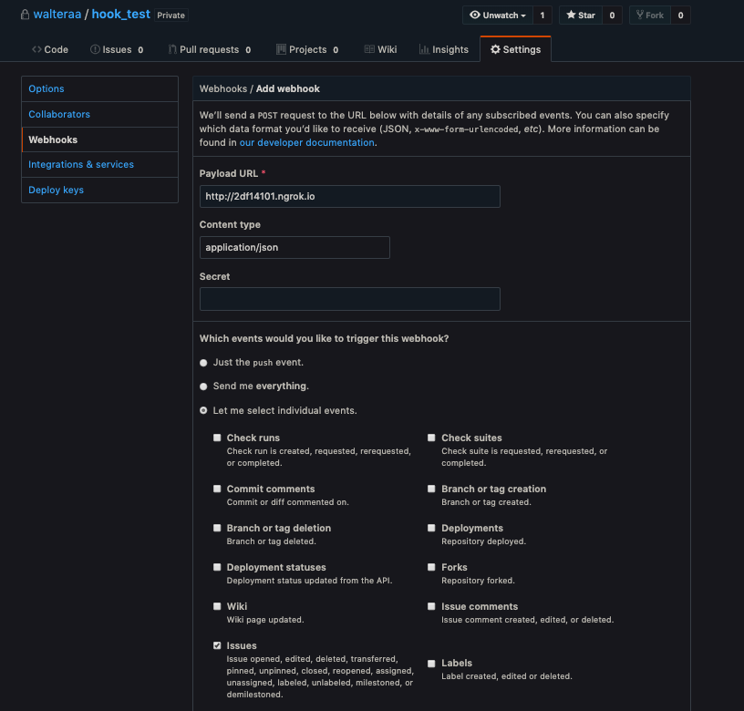
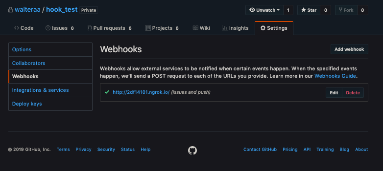

# Jaya Github webhook challenge

## Archtectural overview

The approach which I decided using in this project was a microservice approach using a kind of pub/sub(Or producer/Consumer)
archtecture using a message broker for communication. The webhook system is composed by 3 microservices:


* The entrypoint: Is the server which handle the Github HTTP request and add it in a Queue.
  * Some checks can be done here using the Request Header:
    * Security: We use the SHA-1 Signature, but it is optional.
    * We check the Issue Name is allowed
* The Consumer; The consumer subscribe itself in the same queue which the Entrypoint publishes and processes it,
Saving the data in the database. Some checks is done in some of the Payload fields.
* The Query: This microservice is a read-only API, which consumes the data saved in the database from Consumer, and respond
it thought a REST API.


The main advantage in using this archtecture is that it is almost fully scalable and very resilient, once the services 
are independent each other.

For example: If the Entrypoint is down, the events already added in the message broker can be processed by the consumer.
If the consumer and the Entrypoint down, The Query API can be accessed and respond the already saved events on database.
If the Query system is down, the events can be stored in the database.

In addition, the services can be distributed and balanced by a loadbalancer, once they are independent, so we can improve the
entire system performance by doing a horizontal scaling up.


## How to run the system

From here, I am assuming you are The Java 8 installed on your system as weell as Gradle, Docker and docker-compose.
All the deploy is done by Docker. 

To run the system "manually", you need to enter in each of services directory(`entrypoint-service`, `consumer-service` and `query-service`)
and need run the build command

> For this example I will use the `entrypoint-service` as example. For the other services, You just need to replace `entrypoint-service`
label for the other two listed above.

```
$ cd entrypoint-service/
$ ./gradlew ./gradlew build shadowJar

(...)
BUILD SUCCESSFUL in 3s
16 actionable tasks: 2 executed, 14 up-to-date
$
```

After that, you need to copy the Dockerfile of each project inside the `$project_root/build/libs`

```
$ cp Dockerfile  build/libs/
$
```

And then, you need to build the containers for each project by running the following script inside the service root path

```
$ docker build -t entrpoint-service:dev build/libs/
  Sending build context to Docker daemon  11.86MB
  Step 1/5 : ARG VERSION=8u151
  Step 2/5 : FROM openjdk:${VERSION}-jdk
   ---> a30a1e547e6d
  Step 3/5 : COPY webhook-entrypoint-1.0-all.jar /bin/runner/run.jar
   ---> Using cache
   ---> 02c29ac6cff5
  Step 4/5 : WORKDIR /bin/runner
   ---> Using cache
   ---> 3287b2ae9c8d
  Step 5/5 : CMD ["java","-jar","run.jar"]
   ---> Using cache
   ---> d42f27709b17
  Successfully built d42f27709b17
  Successfully tagged entrpoint-service:dev
 $
```


After do these steps for each service, you'll be able to run the docker-compose file added in the `deploy`
folder.

You can do it all once by running the following script, which is inside the repository root named  `build.sh`

```
#!/bin/bash

declare -a services=("entrypoint-service" "consumer-service" "query-service")


for serv in "${services[@]}"
do
    pushd "$serv"
    ./gradlew build shadowJar -x test
    cp ./Dockerfile ./build/libs/
    docker build -t "$serv":dev ./build/libs/
    popd
done

```

Now you are able to run all the project using docker-compose

```
$ cd deploy/
$ docker-compose up
Creating deploy_broker_1 ... done
Creating deploy_db_1     ... done
Creating deploy_consumer_service_1   ... done
Creating deploy_entrypoint_service_1 ... done
Creating deploy_query_service_1      ... done
Attaching to deploy_db_1, deploy_broker_1, deploy_consumer_service_1, deploy_entrypoint_service_1, deploy_query_service_1
```

Then you will start to see lots of logs which was added in the application and frameworks logs.

> You can run this commnand in daemon mode by passing the -d flag.


## Testing github webhook communication

To test our system, we will need run ngrok by exposing the `entrypoint-service` port. To check what port is exposing the container
to our localhost, you can run the `docker ps` command after start the containers from `docker-compose`

```
$ docker ps
  CONTAINER ID        IMAGE                       COMMAND                  CREATED             STATUS                   PORTS                                                                                        NAMES
  3ca2ccba394f        query-service:dev           "java -jar run.jar"      3 minutes ago       Up 3 minutes             0.0.0.0:8000->8000/tcp                                                                       deploy_query_service_1
  e20fffa93e72        entrypoint-service:dev      "java -jar run.jar"      3 minutes ago       Up 3 minutes             0.0.0.0:8080->8080/tcp                                                                       deploy_entrypoint_service_1
  1ab4d555765c        consumer-service:dev        "java -jar run.jar"      3 minutes ago       Up 3 minutes                                                                                                          deploy_consumer_service_1
  07a011d5ba78        rabbitmq:3.5.7-management   "/docker-entrypoint.…"   7 minutes ago       Up 3 minutes (healthy)   4369/tcp, 5671/tcp, 15671/tcp, 25672/tcp, 0.0.0.0:5672->5672/tcp, 0.0.0.0:15673->15672/tcp   deploy_broker_1
  5ccd448e80fa        postgres:9.5.4              "/docker-entrypoint.…"   7 minutes ago       Up 3 minutes (healthy)   0.0.0.0:5432->5432/tcp                                                                       deploy_db_1
```

You can see that the container **deploy_entrypoint_service_1** is exposing the port `8080`

So, we need to expose the port through the command `$ ngrok http 8080`

```
ngrok by @inconshreveable                                                                                                                                                                 (Ctrl+C to quit)

Session Status                online
Account                       Walter (Plan: Free)
Version                       2.2.8
Region                        United States (us)
Web Interface                 http://127.0.0.1:4040
Forwarding                    http://2df14101.ngrok.io -> localhost:8080
Forwarding                    https://2df14101.ngrok.io -> localhost:8080

Connections                   ttl     opn     rt1     rt5     p50     p90
                              0       0       0.00    0.00    0.00    0.00
```


Then, let' configure our github webhook using the `http://2df14101.ngrok.io` HTTP URL



After confirming, you will be redirect to the webhook list page and can check if the ping msg
was confirmed



You also can check the POST from `ngrok`

```
ngrok by @inconshreveable                                                                                                                                                                 (Ctrl+C to quit)

Session Status                online
Account                       Walter (Plan: Free)
Version                       2.2.8
Region                        United States (us)
Web Interface                 http://127.0.0.1:4040
Forwarding                    http://2df14101.ngrok.io -> localhost:8080
Forwarding                    https://2df14101.ngrok.io -> localhost:8080

Connections                   ttl     opn     rt1     rt5     p50     p90
                              2       0       0.02    0.01    31.05   31.43

HTTP Requests
-------------

POST /                         200 OK
```

Now, we can check that in the `ngrok` interface a new post come

```
ngrok by @inconshreveable                                                                                                                                                                 (Ctrl+C to quit)

Session Status                online
Account                       Walter (Plan: Free)
Version                       2.2.8
Region                        United States (us)
Web Interface                 http://127.0.0.1:4040
Forwarding                    http://2df14101.ngrok.io -> localhost:8080
Forwarding                    https://2df14101.ngrok.io -> localhost:8080

Connections                   ttl     opn     rt1     rt5     p50     p90
                              2       0       0.01    0.01    31.05   31.43

HTTP Requests
-------------

POST /                         202 Accepted
POST /                         200 OK
```


We can see some logs on `docker-compose` when not running in daemon mode
```
consumer_service_1    | 2019-01-14 00:27:45 INFO  EventRepository:53 - Creating Issue
consumer_service_1    | 2019-01-14 00:27:45 INFO  IssueRepository:45 - Inserting issue: Issue(issueId=null, issueNumber=2, repositoryId=165537216, repositoryName=walteraa/hook_test, issueSender=walteraa, events=null) in the database
consumer_service_1    | 2019-01-14 00:27:45 INFO  EventRepository:56 - Inserting first event of the new Issue on database
```

Now, lets edit the issue and we can check a new event coming

```
ngrok by @inconshreveable                                                                                                                                                                 (Ctrl+C to quit)

Session Status                online
Account                       Walter (Plan: Free)
Version                       2.2.8
Region                        United States (us)
Web Interface                 http://127.0.0.1:4040
Forwarding                    http://2df14101.ngrok.io -> localhost:8080
Forwarding                    https://2df14101.ngrok.io -> localhost:8080

Connections                   ttl     opn     rt1     rt5     p50     p90
                              3       0       0.01    0.01    30.68   31.43

HTTP Requests
-------------

POST /                         202 Accepted
POST /                         202 Accepted
POST /                         200 OK
```

```
broker_1              |
broker_1              | =INFO REPORT==== 14-Jan-2019::00:30:50 ===
broker_1              | closing AMQP connection <0.623.0> (172.24.0.4:39514 -> 172.24.0.3:5672)
consumer_service_1    | 2019-01-14 00:30:50 INFO  EventRepository:68 - Inserting Event on database
```


Now let's query the issue and see some issue details, is it important to notice that our microservices
are running in differente containers, then the `ngrok` exposes only the `entrypoint-service`, if we want
to expose the query service, we need to run `ngrok` over the `8000` port. 

```
$ curl -v localhost:8000/2
  *   Trying ::1...
  * TCP_NODELAY set
  * Connected to localhost (::1) port 8000 (#0)
  > GET /2 HTTP/1.1
  > Host: localhost:8000
  > User-Agent: curl/7.54.0
  > Accept: */*
  >
  < HTTP/1.1 200 OK
  < Date: Mon, 14 Jan 2019 00:34:45 GMT
  < Server: Javalin
  < Content-Type: application/json
  < Content-Length: 109
  <
  * Connection #0 to host localhost left intact
  {"issue_number":2,"repository_id":165537216,"repository_name":"walteraa/hook_test","issue_sender":"walteraa"}⏎
 ```
 
 And we can see the two events added on our backend

```
curl -v localhost:8000/2/events
*   Trying ::1...
* TCP_NODELAY set
* Connected to localhost (::1) port 8000 (#0)
> GET /2/events HTTP/1.1
> Host: localhost:8000
> User-Agent: curl/7.54.0
> Accept: */*
>
< HTTP/1.1 200 OK
< Date: Mon, 14 Jan 2019 00:37:03 GMT
< Server: Javalin
< Content-Type: application/json;charset=utf-8
< Content-Length: 14865
<
[{"action":"opened","issue":{"url":"https://api.github.com/repos/walteraa/hook_test/issues/2","repository_url":"https://api.github.com/repos/walteraa/hook_test","labels_url":"https://api.github.com/repos/walteraa/hook_test/issues/2/labels{/name}","comments_url":"https://api.github.com/repos/walteraa/hook_test/issues/2/comments","events_url":"https://api.github.com/repos/walteraa/hook_test/issues/2/events","html_url":"https://github.com/walteraa/hook_test/issues/2","id":398717387,"node_id":"MDU6SXNzdWUzOTg3MTczODc=","number":2,"title":"My First Issue!","user":{"login":"walteraa","id":5852041,"node_id":"MDQ6VXNlcjU4NTIwNDE=","avatar_url":"https://avatars1.githubusercontent.com/u/5852041?v=4","gravatar_id":"","url":"https://api.github.com/users/walteraa","html_url":"https://github.com/walteraa","followers_url":"https://api.github.com/users/walteraa/followers","following_url":"https://api.github.com/users/walteraa/following{/other_user}","gists_url":"https://api.github.com/users/walteraa/gists{/gist_id}","starred_url":"https://api.github.com/users/walteraa/starred{/owner}{/repo}","subscriptions_url":"https://api.github.com/users/walteraa/subscriptions","organizations_url":"https://api.github.com/users/walteraa/orgs","repos_url":"https://api.github.com/users/walteraa/repos", (...)]
```

### Extra features I've done

#### Pagination

I added the pagination in both of path: `/:id` and `/:id/issues`, then you can paginate better

```
$ curl -v 'http://localhost:8000/?page=2&count=1'
*   Trying ::1...
* TCP_NODELAY set
* Connected to localhost (::1) port 8000 (#0)
> GET /?page=2&count=1 HTTP/1.1
> Host: localhost:8000
> User-Agent: curl/7.54.0
> Accept: */*
>
< HTTP/1.1 200 OK
< Date: Mon, 14 Jan 2019 00:41:47 GMT
< Server: Javalin
< Content-Type: application/json
< Content-Length: 111
<
* Connection #0 to host localhost left intact
[{"issue_number":3,"repository_id":165537216,"repository_name":"walteraa/hook_test","issue_sender":"walteraa"}]⏎                                                                                          walter in ~ ➜  curl -v 'http://localhost:8000/?page=2&count=2'
$ curl -v 'http://localhost:8000/?page=2&count=2'
*   Trying ::1...
* TCP_NODELAY set
* Connected to localhost (::1) port 8000 (#0)
> GET /?page=2&count=2 HTTP/1.1
> Host: localhost:8000
> User-Agent: curl/7.54.0
> Accept: */*
>
< HTTP/1.1 200 OK
< Date: Mon, 14 Jan 2019 00:41:58 GMT
< Server: Javalin
< Content-Type: application/json
< Content-Length: 221
<
* Connection #0 to host localhost left intact
[{"issue_number":4,"repository_id":165537216,"repository_name":"walteraa/hook_test","issue_sender":"walteraa"},{"issue_number":5,"repository_id":165537216,"repository_name":"walteraa/hook_test","issue_sender":"walteraa"}]⏎
```

#### Security by using the the Github signature Header

To do that, let's change the deployment environment `.env` file which is in the `/deploy` path by adding the `GITHUB_SECRET` Environment
variable

```
SERVER_PORT=8080
QUEUE_NAME=issues
DB_NAME=webhook
DB_USER=postgres
DB_PASSWORD=passwd
DB_SCHEMA=github_webhook
SERVER_QUERY_PORT=8000
BROKER_QUEUE_WHITE_LIST=issues,ping
GITHUB_SECRET=testgithubsecret
```

And then, restart the service and let's try to add a new webhook and we will not configure the secret on github

You can check that the `ngrok` response the github ping with `Unauthorized` error

```
ngrok by @inconshreveable                                                                                                                                                                 (Ctrl+C to quit)

Session Status                online
Account                       Walter (Plan: Free)
Version                       2.2.8
Region                        United States (us)
Web Interface                 http://127.0.0.1:4040
Forwarding                    http://2df14101.ngrok.io -> localhost:8080
Forwarding                    https://2df14101.ngrok.io -> localhost:8080

Connections                   ttl     opn     rt1     rt5     p50     p90
                              10      0       0.02    0.01    30.15   31.35

HTTP Requests
-------------

POST /                         401 Unauthorized
POST /                         202 Accepted
POST /                         202 Accepted
POST /                         202 Accepted
POST /                         202 Accepted
```

Now, let's try configuring the webhook by passing the `testgithubsecret` as secret

```
ngrok by @inconshreveable                                                                                                                                                                 (Ctrl+C to quit)

Session Status                online
Account                       Walter (Plan: Free)
Version                       2.2.8
Region                        United States (us)
Web Interface                 http://127.0.0.1:4040
Forwarding                    http://2df14101.ngrok.io -> localhost:8080
Forwarding                    https://2df14101.ngrok.io -> localhost:8080

Connections                   ttl     opn     rt1     rt5     p50     p90
                              10      0       0.02    0.01    30.15   31.35

HTTP Requests
-------------

POST /                         200 OK
POST /                         401 Unauthorized
POST /                         202 Accepted
POST /                         202 Accepted
POST /                         202 Accepted
POST /                         202 Accepted
```

#### Running tests

Once we need the infra to run the tests, we should startup the `docker-compose.yml` added in the path `test_infra`, regarding some configurations,
It can show conflicts.

```
$ cd test-infra/
$ docker-compose up
docker-compose up
Creating network "test-infra_integration_network" with the default driver
Creating volume "test-infra_db_data" with default driver
Creating volume "test-infra_broker_data" with default driver
Creating test-infra_db_1     ... done
Creating test-infra_broker_1 ... done
Attaching to test-infra_broker_1, test-infra_db_1
db_1      | The files belonging to this database system will be owned by user "postgres".
db_1      | This user must also own the server process.
db_1      |
db_1      | The database cluster will be initialized with locale "en_US.utf8".
db_1      | The default database encoding has accordingly been set to "UTF8".
db_1      | The default text search configuration will be set to "english".
```

And then you can run the tests for each project from the terminal by running `./gradlew tests` or from intellij.


#### Additional information

I was think in add some query params for seaerch and a nginx as API gateway to respec the path requirements added in the README, but regarding to the short time
I decided don't do that.