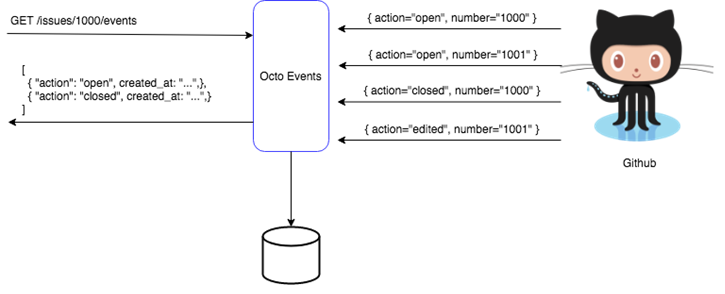

# Octo Events

Octo Events é uma aplicação que recebe eventos do Github Events via webhooks e os expõe via API para uso futuro.



 O teste consiste na construção de 2 endpoints:

## 1. Endpoint Webhook

O endpoint Webhook recebe eventos do Github e os salva no banco. A fim de implementá-lo, leia os seguintes docs:

* Webhooks Overview: https://developer.github.com/webhooks/ 
* Creating Webhooks : https://developer.github.com/webhooks/creating/

O endpoint deve ser disponibilizado em `/events`

## 2. Endpoint Events 

O endpoint Events irá expor eventos por uma API que os filtrará através do número da issue:

**Request:**

> GET /issues/1000/events

**Response:**

> 200 OK
```javascript
[ 
  { "action": "open", created_at: "...",}, 
  { "action": "closed", created_at: "...",} 
]
```

**Instruções de integração com o Github **

* Dica: Você pode usar o ngrok (https://ngrok.com/) para instalar / debugar as chamadas do webhook. Ele gera uma URL pública que irá rotear para sua máquina:

   $ sudo ngrok http 4000 


   GitHub


 
**Observações finais**

* Use qualquer biblioteca ou framework que quiser, você não precisa fazer nada "do zero";
* Ë obrigatório escrever testes, use seu framework favorito pra isso;
* Use o Postgres 9.6 como banco;
* Adicione um README.md com instruções para executar o projeto.
* Executaremos seu código com a última versão do Java ou Kotlin (se usar);
* Sucesso! :-)
